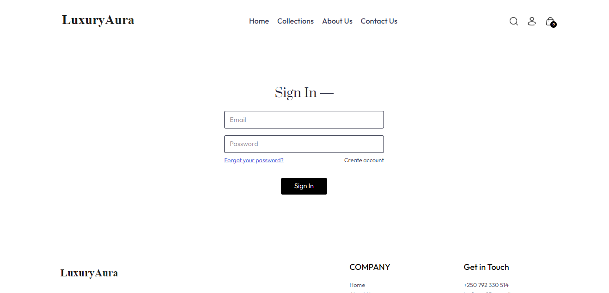
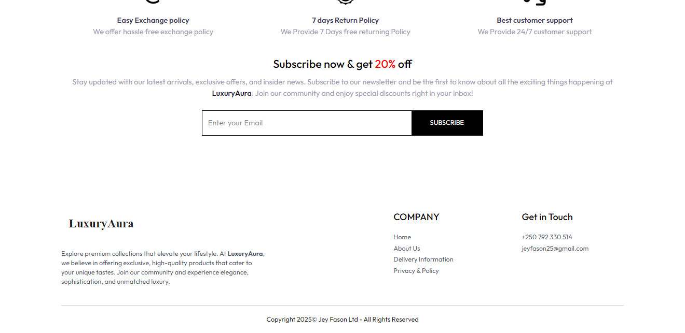

# **Fullstack E-Commerce Project** by **Jey Fason** 🚀

This is a **Fullstack E-Commerce application** designed to showcase my expertise in fullstack development. It integrates **Stripe payment**, **cash on delivery**, and provides a smooth user experience with both **customer** and **admin** features.

## **Key Features**

- **💳 Stripe Payment Integration**: Secure online payments using **Stripe** for fast and reliable transactions.
- **💵 Cash on Delivery**: Customers have the option to pay for their order upon delivery, offering convenience and flexibility.
- **👤 User Account Creation**: Users can sign up, log in, and manage their accounts with ease.
- **🛒 Add to Cart**: Easily add products to the cart and proceed to checkout in just a few clicks.
- **📦 Order Placement**: Users can place orders and track their purchases.
- **🖥️ Admin Panel**: Admins can manage products, view customer orders, and maintain overall control of the platform.

## **Tech Stack**

### **Backend**

- **🔧 Node.js** & **🛠️ Express**: Server-side development using **Node.js** with the **Express** framework for building a fast, scalable API.
- **📸 Multer** & **☁️ Cloudinary**: Image uploading and cloud storage handled by **Multer** and **Cloudinary**.
- **💳 Stripe**: Integrated **Stripe** for secure online payments.
- **📚 Mongoose**: Simplified database management using **Mongoose** for interacting with **MongoDB**.
- **🗃️ MongoDB**: A NoSQL database for efficient data storage and flexibility.

### **Frontend**

- **⚛️ React with Typescript**: A dynamic and responsive frontend powered by **React.js** for a seamless user experience with typescript to make code cleaner and easy to maintain.
- **🎨 Tailwind CSS**: Styling with **Tailwind CSS** for a modern and responsive design that’s easily customizable.

## **Screenshots**

Here are how Project looks like and there is more feature feel free to move around.

1. **About Us**: 
2. **Login**: 
3. **Payment**: 
4. **Other**: 

## **Purpose of the Project**

This project was created to **enhance my skills** in fullstack development and **master** industry-standard tools and technologies like **Node.js**, **MongoDB**, **React.js**, and **Stripe**. The goal was to build a robust e-commerce platform that integrates secure payment options, provides a seamless user experience, and offers easy administration.

## **Get in Touch**

If you have any questions, feedback, or want to discuss the project further, feel free to reach out to me.

- 📧 **Email**: [jeyfason25@gmail.com](mailto:jeyfason25@gmail.com)
- 🗨️ **Whatsapp**: [Text me here](https://wa.me/250792330514)
